# Reproduction repository for #3223

https://github.com/diesel-rs/diesel/issues/3223

Using Diesel's joins has projects type check in time exponential in the number of joins, despite incremental compilation.

This leads to crates using Diesel quickly getting up to unreasonable IDE feedback time. (`cargo check` after a simple unrelated change takes 2min to start giving compilation feedback in one of our crates managing a complex schema of ~100 tables due to this, with some small function bodies taking up to ~5s to typecheck!)

## How to reproduce

We'll generally be using this repo and https://blog.rust-lang.org/inside-rust/2020/02/25/intro-rustc-self-profile.html

### Install necessary tooling
```bash
cargo install --git https://github.com/rust-lang/measureme crox
rustup install nightly
```

### Clone this repo
```bash
git clone https://github.com/Ten0/diesel_3223_repro.git
cd diesel_3223_repro/compile_time_test
```

### Measure stuff

1. Compile a first time to setup incremental compilation cache for the crate
	```bash
	cargo +nightly rustc --lib --profile check
	```

2. Go edit `src/bodies.rs`:
   - Uncomment the `different_each_regen` function
   - Add one `println!("Helloo!");`

3. Compile a second time with self-profiling enabled, then turn generated file into something Chrome can open
	```bash
	cargo +nightly rustc --lib --profile check -- -Zself-profile -Zself-profile-events=default,args
	crox --minimum-duration 2 compile_time_test-<number_of_file_just_created>.mm_profdata
	```

4. Follow the self-profiling guide to open the file in Chrome, that is:
   - Open Chrome
   - Open the Developer Tools console by pressing Ctrl + Shift + i (Windows/Linux) or Cmd + Option + i (macOS)
   - Click the Performance tab at the top of the console.
   - Click the "Load profile" button which looks like an arrow pointing up.
   - Select the chrome_profiler.json file we created.

5. Observe the typeck time of the `body_0` function (4 joins):
   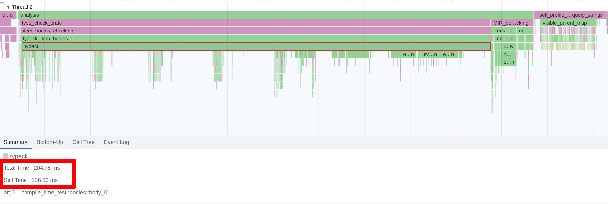

6. Go add one join to `src/bodies.rs`
   - Uncomment one of the two joins in `body_0`:
      ```rust
      schema::some_table_5::table.inner_join(
          schema::some_table_6::table/*.inner_join(schema::some_table_7::table)*/,
      ),
      ```
   - Comment the `different_each_regen` function
   - Do steps 1 to 4 again (preparing incremental compilation cache, changing one function elsewhere in the code such that we won't hit any previous incremental compilation cache, check with profiling enabled, open results)

7. Observe the typeck time of the `body_0` function (5 joins):
   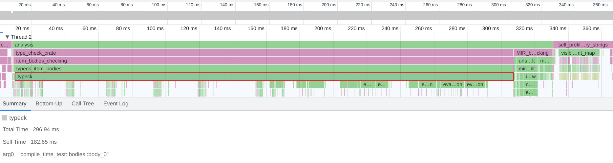

8. Let's do it once more with 6 joins:
   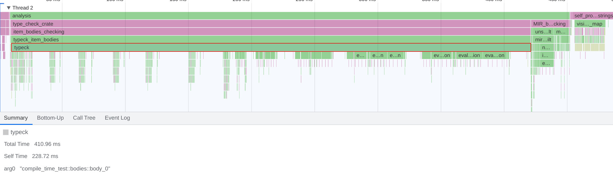

9. 7 joins:
   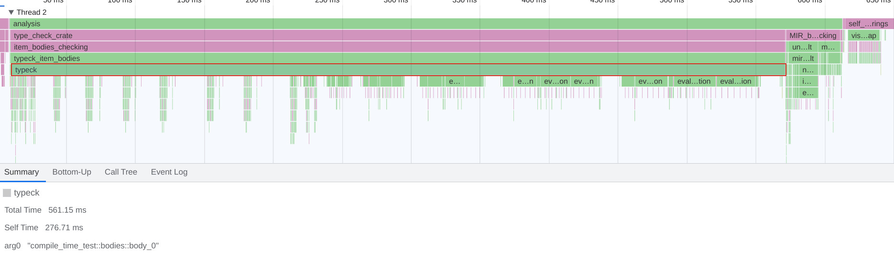

10. 10 joins:
   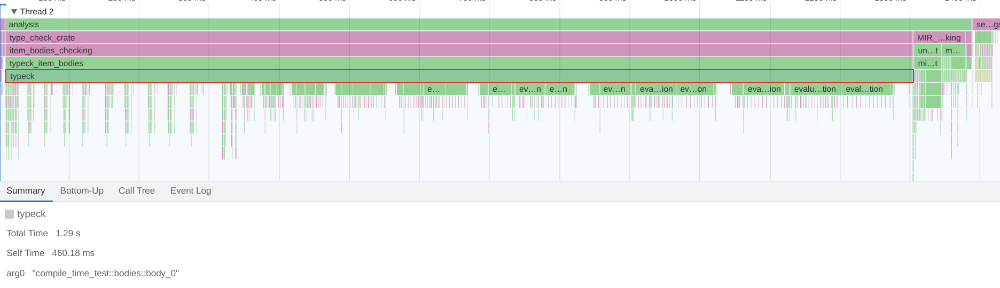

11. 11 joins:
   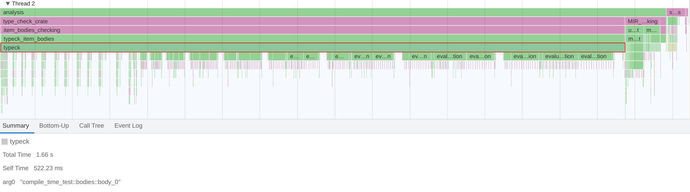

12. 14 joins:
   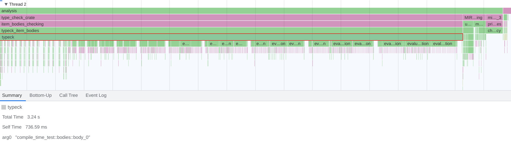

13. 20 joins:
   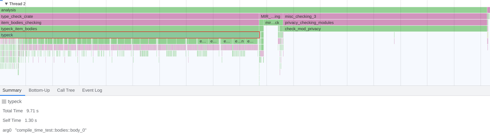

14. 21 joins:
   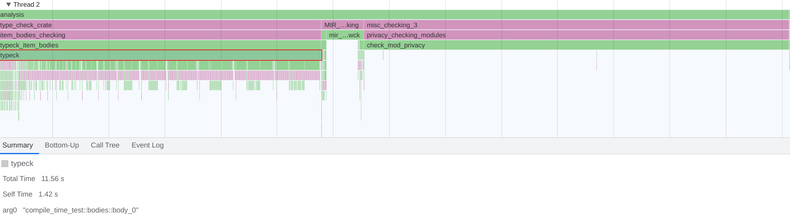

15. 25 joins:
   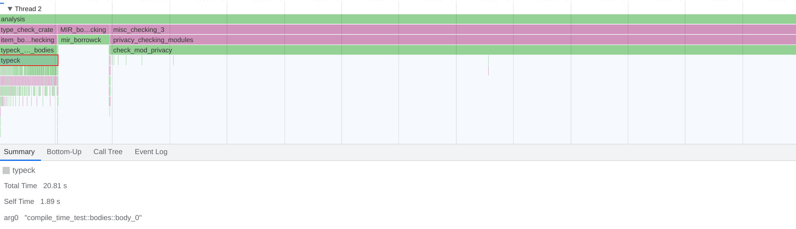

16. `typeck` times:
	| nb_joins | time (ms) |
	|----------|-----------|
	| 4        | 204       |
	| 5        | 296       |
	| 6        | 410       |
	| 7        | 561       |
	| 10       | 1290      |
	| 11       | 1660      |
	| 14       | 3240      |
	| 17       | 5880      |
	| 20       | 9710      |
	| 21       | 11560     |
	| 25       | 20810     |

	It appears the `typeck` time formula fits very well with an exponential curve:  
    $t = a \times b^n$ + c  
	where $n$ is the number of joins, $a$ = 552.792, $b$ = 1.15846, $c$ = -894:
	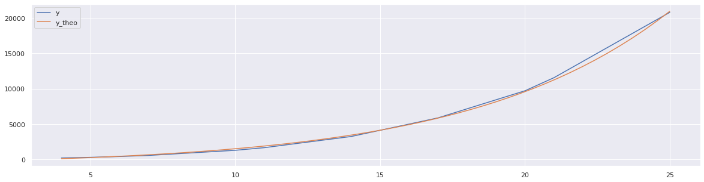
	(You may look for other fitting curves at https://www.dcode.fr/function-equation-finder - notably it's not completely impossible to find ~matching curves with polynomial of degree ~3)
	

---
You may also notice that `check_mod_privacy` also starts taking an unreasonable amount of time (even more non-linear) above 14 joins but 14 joins rarely happens in practice and as long as I get IDE feedback on the rest, which runs before, I'm fine so that hasn't been an issue for us yet. Nevertheless I'm pointing it out in case someone is interested in investigating this...
